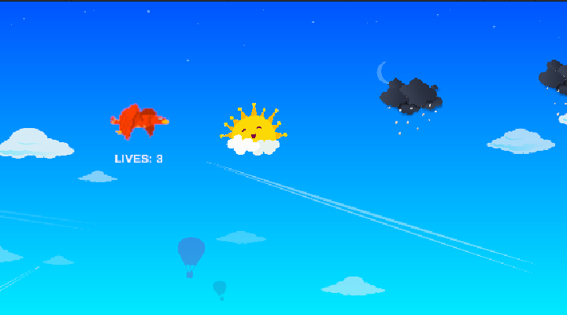
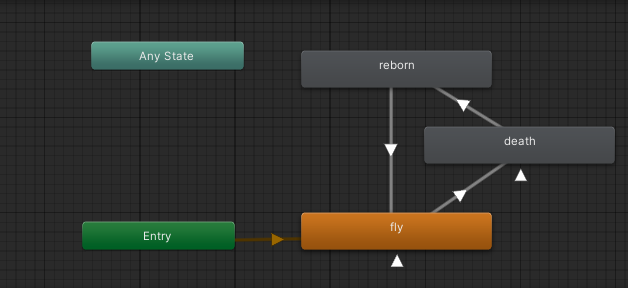
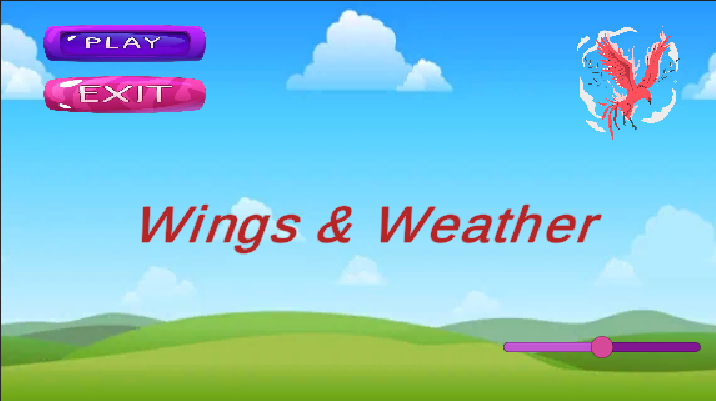
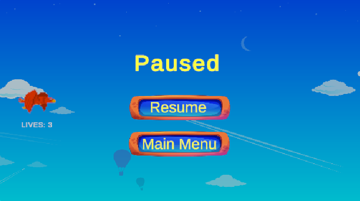
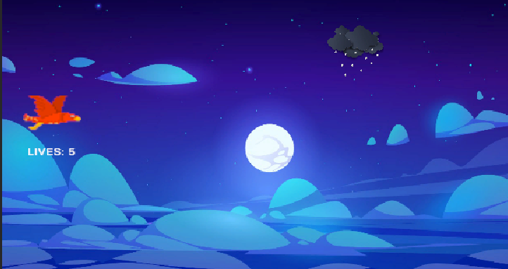

# Wings & Weather 2

## How to Play
- The game starts at the **Main Menu**, where you can control all game sounds using the **slider** in the bottom-right corner.
- Click the **Play** button in the top-left corner to start the game.
- Press **Escape** during gameplay to open the **Pause Menu**, where you can return to the Main Menu.
- Navigate the phoenix to interact with clouds and avoid losing all lives.
- When the bird's lives reach **5**, it moves on to the **second scene**.
- When bird dies, the game **restarts** from the **Main Menu**.

Survive as long as possible while enjoying the immersive animations and sounds!

## Features Demonstrated

### 1. Gameplay Mechanics
- **Phoenix Bird Controls:**  
  The bird moves with arrow keys, restricted to the game window boundaries.
- **Cloud Interactions:**  
  SunnyCloud: Adds a life point and plays a healing sound and shows a healing animation if the bird has previously taken damage from a collision with a stormy cloud.  
  StormyCloud: Reduces a life point, plays a thunderstorm sound and shows a damage animation.
  
  

### 2. Animations
- **Flapping Wings Animation:** Loops while the phoenix is flying.
- **Damage Animation:** Plays when colliding with a StormyCloud.
- **Resurrection Animation:** Plays when the colliding with a SunnyCloud.
- **Smooth Transitions:** Animations switch states immediately based on gameplay conditions using an Animation Controller.
  
  

### 3. User Interface
- **Main Menu:**
  - Logo: Displays the game logo in the top-right corner.
  - Options: Located in the top-left corner.
  - Master Volume Slider: Adjusts all in-game sounds and music.
    
    
- **Pause Menu:**
  - Activated by pressing the Escape key.
  - Displays options in the center of the screen, including "Return to Main Menu."
  - Background is dimmed while the pause menu is active.
    
    

### 4. Scene Management
The game includes two gameplay scenes.
- **Scene Transition Condition:**
  When the phoenix's lives reach 5, the game transitions from the first scene to the second. The gameplay continues seamlessly in the new scene with the same mechanics, but with a different background to signify progression.

- **Smooth Transition:**
  The transition between scenes is asynchronous, ensuring there are no interruptions or delays. The background music continues to play uninterrupted during the transition, maintaining immersion.
  
  

### 5. Audio System
- **Background Music:**
  - Plays from the main menu and continues seamlessly into gameplay scenes.
  - Loops without overlapping or interruptions.
- **Sound Effects:**
  - StormyCloud: Plays a thunderstorm sound on collision.
  - SunnyCloud: Plays a healing sound on collision.
  - Sounds are spatial, reflecting their position relative to the player.

## References

- **Sprites**:
  - Phoenix Model: https://chasersgaming.itch.io/pheonix
  - Cloud Sprites: https://pngtree.com
  - Backgrounds: https://www.freepik.com

- **Sound**:
  - Thunder Sound: <a href="https://pixabay.com/users/blendertimer-9538909/?utm_source=link-attribution&utm_medium=referral&utm_campaign=music&utm_content=245174">Daniel Roberts</a> from <a href="https://pixabay.com/sound-effects//?utm_source=link-attribution&utm_medium=referral&utm_campaign=music&utm_content=245174">Pixabay</a>

  - Healing Sound: <a href="https://pixabay.com/users/benkirb-8692052/?utm_source=link-attribution&utm_medium=referral&utm_campaign=music&utm_content=268907">Benjamin Adams</a> from <a href="https://pixabay.com//?utm_source=link-attribution&utm_medium=referral&utm_campaign=music&utm_content=268907">Pixabay</a>
  - Background Music: Sound Effect by <a href="https://pixabay.com/users/sergequadrado-24990007/?utm_source=link-attribution&utm_medium=referral&utm_campaign=music&utm_content=275487">Sergei Chetvertnykh</a> from <a href="https://pixabay.com/sound-effects//?utm_source=link-attribution&utm_medium=referral&utm_campaign=music&utm_content=275487">Pixabay</a>

## Gameplay Link
https://rojda-o.itch.io/wings-weather-2
